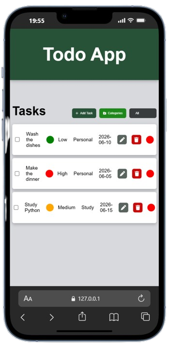
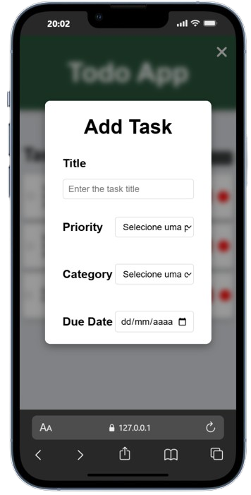
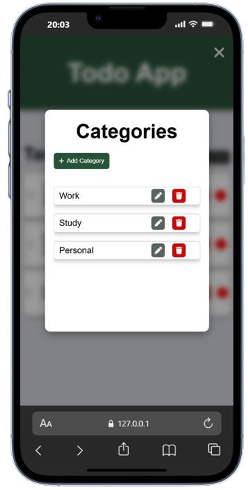
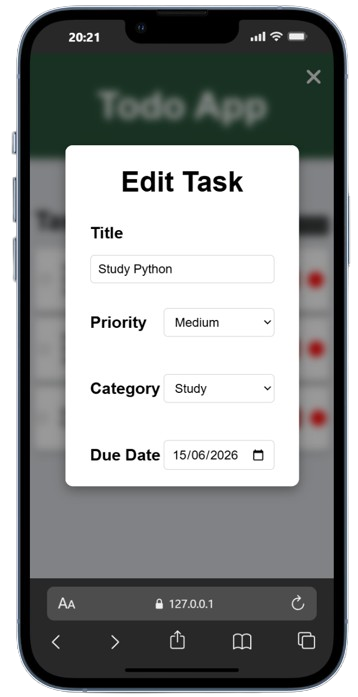
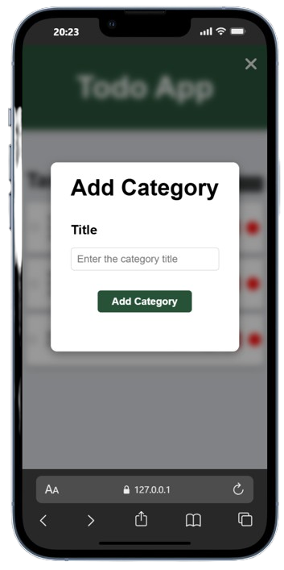

# 📝 Todo List App

A fully client-side **Todo List** web application built with **vanilla HTML, CSS and JavaScript**. The app allows users to create, edit, delete, and filter tasks as well as manage custom categories with all data persisted in the browser's `localStorage`.

---

## 📋 Table of Contents

- [Demo](#demo)
- [Mobile Screenshots](#mobile-screenshots)
- [Overview](#overview)
- [Features](#features)
- [Technologies](#technologies)
- [Architecture](#architecture)
- [Project Structure](#project-structure)
- [Module Breakdown](#module-breakdown)
  - [app.js - Entry Point](#appjs-entry-point)
  - [tasks.js - Task Data Model](#tasksjs-task-data-model)
  - [categories.js - Category Data Model](#categoriesjs-category-data-model)
  - [storage.js - Persistence Layer](#storagejs-persistence-layer)
  - [filters.js - Filtering Logic](#filtersjs-filtering-logic)
  - [ui.js - Rendering Engine](#uijs-rendering-engine)
  - [eventHandlers.js - User Interaction Layer](#eventhandlersjs-user-interaction-layer)
  - [styles.css - Styling](#stylescss-styling)
- [Data Models](#data-models)
- [How It Works](#how-it-works)
- [Getting Started](#getting-started)
- [License](#license)

---

<a id="demo"></a>
## 🎥 Demo

Watch the application in action:

<video src="https://github.com/marcosnunes0/todo-app/raw/main/assets/Todo-App-Demo.mp4" controls width="640"></video>

---

<a id="mobile-screenshots"></a>
## 📱 Mobile Screenshots

<div align="center">

| Home Page | Add Task | Categories |
|:-:|:-:|:-:|
|  |  |  |

| Edit Task | Add Category |
|:-:|:-:|
|  |  |

</div>

---

<a id="overview"></a>
## 🔍 Overview

This project is a single-page, front-end-only task management application. It was built as a learning exercise to practice core JavaScript concepts including:

- 📦 **ES Modules** (`import` / `export`) for clean code organization.
- 🌲 **DOM manipulation** via `innerHTML` and template literals to update the user interface dynamically.
- ⚡ **Event delegation** for handling actions on dynamically generated grid elements.
- 💾 **`localStorage`** for persistent client-side data storage across page reloads.
- 📱 **CSS Grid & Flexbox** for a fluid, responsive layout targeting mobile and desktop.
- 🖼️ **Overlay / modal patterns** for form-based user interactions with background blurring.

No build tools, frameworks or package managers are required, the app runs directly in the browser from a static HTML file.

---

<a id="features"></a>
## ✨ Features

| Feature | Description |
|---|---|
| **Add Task** | Create tasks with a title, priority level (High / Medium / Low), category and due date. |
| **Edit Task** | Modify any field of an existing task via a pre-populated edit form. |
| **Delete Task** | Remove a task permanently from the list. |
| **Toggle Completion** | Mark a task as completed or pending using a checkbox, a color indicator reflects the status. |
| **Filter Tasks** | Filter the task list by status: *All*, *Pending*, or *Completed*. |
| **Add Category** | Create custom categories to organize tasks, duplicate names are rejected. |
| **Edit Category** | Rename a category: all tasks assigned to it are automatically updated. |
| **Delete Category** | Remove a category: all tasks assigned to it fall back to `"Not defined"`. |
| **Data Persistence** | Tasks and categories survive page reloads via `localStorage`. |
| **Responsive Design** | The layout adapts to different screen sizes with CSS media queries. |
| **Modal Overlays** | Forms are displayed in centered modal overlays with a blurred backdrop. |

---

<a id="technologies"></a>
## 🛠️ Technologies

| Technology | Usage |
|---|---|
| **HTML5** | Semantic page structure and container elements for dynamically injected content. |
| **CSS3** | Styling with Flexbox, CSS Grid, media queries, `backdrop-filter` blur, box shadows and transitions. |
| **JavaScript (ES2021+)** | Application logic using ES Modules, `crypto.randomUUID()`, template literals, array methods and `localStorage`. |
| **Font Awesome 6.5** | Icon library loaded from CDN for UI icons (plus, trash, pen, close, folder). |

---

<a id="architecture"></a>
## 📐 Architecture

The application follows a **modular, layered architecture** with clear separation of concerns:

```
┌────────────────────────────────────────────────────────┐
│                      index.html                        │
│               (Static shell & mount points)            │
└───────────────────────────┬────────────────────────────┘
                            │ loads
                            ▼
┌────────────────────────────────────────────────────────┐
│                       app.js                           │
│                    (Entry point)                       │
└───┬──────────────┬─────────────┬──────────────┬────────┘
    │              │             │              │
    ▼              ▼             ▼              ▼
┌────────┐ ┌─────────────┐ ┌──────────┐ ┌────────────────┐
│tasks.js│ │categories.js│ │filters.js│ │eventHandlers.js│
│ (Data) │ │   (Data)    │ │ (Logic)  │ │   (Controls)   │
└───┬────┘ └───┬─────────┘ └───┬──────┘ └────────┬───────┘
    │          │               │                 │
    ▼          ▼               ▼                 ▼
┌────────────────────────────────────────────────────────┐
│                      storage.js                        │
│              (localStorage persistence)                │
└────────────────────────────────────────────────────────┘
                          ▲
                          │ renders via
┌────────────────────────────────────────────────────────┐
│                     ui.js                              │
│         (HTML generation & DOM injection)              │
└────────────────────────────────────────────────────────┘
```

### Design Principles

- **Single Responsibility**: Each module has one job: data, persistence, rendering or event handling.
- **Unidirectional Flow**: User actions → event handlers → data mutation → persistence → re-render.
- **No Framework Dependencies**: Everything is built from scratch with vanilla JavaScript.
- **Event Delegation**: Task and category action buttons are handled through a single delegated listener on the parent grid, rather than attaching individual listeners to each dynamically created element.

---

<a id="project-structure"></a>
## 📂 Project Structure

```
todo-list-app-ex1/
├── index.html              # Main HTML page
├── css/
│   └── styles.css          # All application styles
├── scripts/
│   ├── app.js              # Entry point
│   ├── tasks.js            # Task data model
│   ├── categories.js       # Category data model
│   ├── storage.js          # localStorage utilities
│   ├── filters.js          # Task filtering logic
│   ├── ui.js               # DOM rendering functions
│   └── eventHandlers.js    # Event listener setup and user interaction handlers
├── LICENSE                 # MIT License
└── README.md               # This file
```

---

<a id="module-breakdown"></a>
## 🧱 Module Breakdown

<a id="appjs-entry-point"></a>
### 🚀 `app.js` - Entry Point

The module that initializes the application. It:

1. Loads persisted tasks and categories from `localStorage`.
2. Renders the initial task list to the DOM.
3. Attaches top-level event listeners for the "Add Task" button, filter dropdown, "Categories" button and delegated click handlers on the task and category grids.
4. Persists initial state to `localStorage`.

<a id="tasksjs-task-data-model"></a>
### 📋 `tasks.js` - Task Data Model

Exports the `tasks` array (loaded from storage on module initialization) and four data-manipulation functions:

| Function | Description |
|---|---|
| `addTask(title, priority, category, dueDate)` | Creates a new task object with a UUID and pushes it to the array. |
| `deleteTask(taskId)` | Finds and removes a task by ID. |
| `toggleTaskStatus(taskId)` | Flips the `completed` boolean on a task. |
| `editTask(taskId, title, priority, category, dueDate)` | Updates all editable fields on an existing task. |

<a id="categoriesjs-category-data-model"></a>
### 🏷️ `categories.js` - Category Data Model

Exports the `categories` array and three functions:

| Function | Description |
|---|---|
| `addCategory(title)` | Creates a new category if the title is not a duplicate. |
| `deleteCategory(categoryId)` | Removes the category and reassigns all associated tasks to `"Not defined"`. |
| `editCategory(categoryId, title)` | Renames the category and propagates the new name to all associated tasks. |

<a id="storagejs-persistence-layer"></a>
### 💾 `storage.js` - Persistence Layer

A thin abstraction over `localStorage` providing four functions:

| Function | Description |
|---|---|
| `saveTasks(tasks)` | Serializes and stores the tasks array under the `"tasks"` key. |
| `loadTasks()` | Deserializes the tasks array, returning `[]` if nothing is stored. |
| `saveCategories(categories)` | Serializes and stores the categories array under the `"categories"` key. |
| `loadCategories()` | Deserializes the categories array, returning `[]` if nothing is stored. |

<a id="filtersjs-filtering-logic"></a>
### 🔍 `filters.js` - Filtering Logic

Exports a single function:

| Function | Description |
|---|---|
| `getFilteredTasks(filter)` | Accepts `"all"`, `"pending"` or `"completed"` and returns the corresponding subset of the tasks array. |

<a id="uijs-rendering-engine"></a>
### 🎨 `ui.js` - Rendering Engine

The largest module, responsible for generating HTML strings via template literals and injecting them into the DOM. It contains:

| Function | Description |
|---|---|
| `renderTasks(tasks)` | Renders the task list grid or a "No tasks found" message if empty. Includes checkbox, title, priority (with color dot), category, due date, edit/delete buttons and a completion status indicator. |
| `renderAddTaskForm(categories)` | Renders the "Add Task" modal form with inputs for title, priority, category (populated from the categories array) and due date. |
| `renderEditTaskForm(task, categories)` | Renders the "Edit Task" modal form pre-populated with the selected task's current values. |
| `renderCategories(categories)` | Renders the categories list modal, showing each category with edit and delete action buttons. |
| `renderAddCategoryForm()` | Renders the "Add Category" modal form. |
| `renderEditCategoryForm(category)` | Renders the "Edit Category" modal form pre-populated with the current category title. |
| `handleOverlayEvents(overlayId, closeBtnId)` | Attaches close behavior to a modal by clicking on the backdrop or the close button. |
| `hiddenOverlay(overlayId)` | Hides a modal overlay by adding the `hidden` CSS class. |

**Helper functions**:

| Function | Description |
|---|---|
| `colorPicker(task)` | Returns `"green"` for completed tasks and `"red"` for pending. |
| `priorityColor(priority)` | Maps priority levels to colors: High → red, Medium → orange, Low → green. |

<a id="eventhandlersjs-user-interaction-layer"></a>
### 🔄 `eventHandlers.js` - User Interaction Layer

Acts as the **controller** layer, bridging UI events with data operations and re-renders. It orchestrates the full lifecycle for each user action:

1. **Capture** the event (button click, form submit, dropdown change).
2. **Extract** data from the DOM (form inputs, `data-*` attributes).
3. **Call** the appropriate data function (`addTask`, `editTask`, `deleteCategory`, etc.).
4. **Persist** updated state via `saveTasks()` / `saveCategories()`.
5. **Re-render** the affected UI sections.
6. **Dismiss** the modal overlay if applicable.

<a id="stylescss-styling"></a>
### 🖌️ `styles.css` - Styling

A single CSS file that styles the entire application, including:

- **Global Reset**: `box-sizing: border-box`, zero padding/margin, Poppins font family.
- **Header Banner**: A dark green full-width header.
- **Task Cards**: CSS Grid rows with 5 equal columns displaying checkbox, title, priority, category, due date and action buttons.
- **Modal Overlays**: Fixed-position full-screen overlays with `backdrop-filter: blur(5px)` and centered white card containers.
- **Form Layouts**: Flexbox-based vertical form layouts with consistent spacing.
- **Buttons**: Styled action buttons with hover transitions and color-coded semantics (green for add, red for delete, gray for edit).
- **Responsive Breakpoints**: Media queries at `550px` and `430px` for mobile-friendly adjustments.

---

<a id="data-models"></a>
## 🗃️ Data Models

### Task Object

```javascript
{
  id: "uuid-string",          // Generated via crypto.randomUUID()
  title: "Task title",        // User-provided, trimmed
  completed: false,           // Boolean toggle
  priority: "High",           // "High" | "Medium" | "Low"
  category: "Work",           // Category title string or "Not defined"
  dueDate: "2026-06-15",      // ISO date string (YYYY-MM-DD)
  createdAt: "2026-06-09"     // Auto-generated on creation (YYYY-MM-DD)
}
```

### Category Object

```javascript
{
  id: "uuid-string",          // Generated via crypto.randomUUID()
  title: "Category name"      // User-provided, trimmed
}
```

---

<a id="how-it-works"></a>
## ⚙️ How It Works

1. **On page load**, `app.js` runs `initApp()`, which loads saved data from `localStorage`, renders the task list and sets up all event listeners.
2. **Adding a task**: Clicking "Add Task" opens a modal form. On submission, a new task object is created, pushed to the in-memory array, saved to `localStorage` and the task list is re-rendered.
3. **Editing a task**: Clicking the edit (pen) icon on a task opens a pre-filled modal form. On submission, the task is updated in place, persisted and re-rendered.
4. **Deleting a task**: Clicking the delete (trash) icon removes the task from the array, persists the change and re-renders.
5. **Toggling completion**: Clicking a task's checkbox toggles its `completed` status, persists and re-renders with updated color indicators.
6. **Filtering**: Changing the filter dropdown triggers a re-render with only the matching subset of tasks.
7. **Categories**: The categories modal allows CRUD operations on categories. Renaming or deleting a category automatically updates all tasks referencing it.

---

<a id="getting-started"></a>
## 🚀 Getting Started

### 📋 Prerequisites

- A modern web browser (Chrome, Firefox, Edge, Safari) that supports ES Modules and `crypto.randomUUID()`.

### 💻 Running Locally

1. 👥 **Clone the repository:**
   ```bash
   git clone https://github.com/marcosnunes0/todo-app.git
   cd todo-app
   ```

2. 🌐 **Open `index.html` in your browser:**
   - Simply double-click the file, **or**
   - Use a local development server (recommended for ES Modules):
     ```bash
     # Using Python
     python -m http.server 8000

     # Using Node.js (npx)
     npx serve .
     ```
   - Then navigate to `http://localhost:8000` in your browser.

> **Note:** Some browsers block ES Module imports when opening files directly via `file://`. If tasks or categories don't load, use a local server instead.

---

<a id="license"></a>
## 📄 License

This project is licensed under the **MIT License**. See the [LICENSE](LICENSE) file for details.